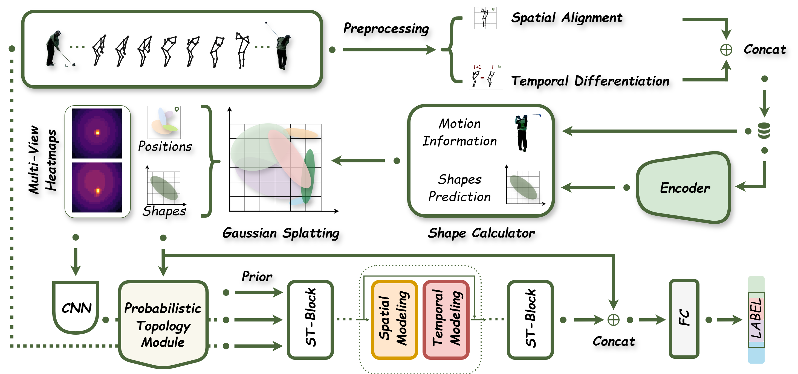

# KGS-GCN: Kinematics-Driven Gaussian Splatting and Probabilistic Topology for Skeleton-Based Action Recognition

<p align="center">
  <a href="https://ieeexplore.ieee.org/abstract/document/11602683"></a>
  <a href="https://arxiv.org/abs/2603.16943"></a>
  
  
</p>

> **🎉 Congratulations! This work has been accepted for publication in the *IEEE Sensors Journal*.**
>
> - **Paper (IEEE Xplore):** https://ieeexplore.ieee.org/abstract/document/11602683
> - **Preprint (arXiv):** https://arxiv.org/abs/2603.16943

Official PyTorch implementation of **KGS-GCN**, a graph convolutional network that unifies **kinematics-driven Gaussian splatting** and **probabilistic topology construction** for skeleton-based action recognition.

---

## Graphical Abstract

<p align="center">
  
</p>

## Introduction

Typical motion-capture sensors output sparse and discrete joint coordinates. Such representations tend to lose fine-grained spatiotemporal information during highly dynamic movements, and the predefined physical skeleton topology restricts the modeling of latent long-range dependencies.

KGS-GCN addresses these two bottlenecks by rethinking joint representation and graph construction from the perspectives of kinematics and probability:

- **Kinematics-Driven Gaussian Splatting Module (KGSM).** Instantaneous joint velocity vectors are extracted to dynamically build anisotropic covariance matrices, rendering sparse skeleton sequences into multi-view continuous heatmaps. Stationary joints degenerate into isotropic kernels, while fast-moving joints are stretched along their motion direction, so that velocity magnitude and orientation become intrinsic properties of the representation.
- **Probabilistic Topology (PT).** Each joint is modeled as a Gaussian distribution, and the Bhattacharyya distance between distributions quantifies their statistical correlation, yielding an interpretable, sample-adaptive prior adjacency matrix that complements the physical graph.
- **Visual Context Gating (VCG).** A lightweight multi-view rendering branch and the topological GCN backbone are unified through a residual gating mechanism, fusing continuous dynamic cues with structural priors.

The whole framework requires only **1.4M parameters and 1.3 GFLOPs**, and remains notably robust under degraded sensing conditions such as joint dropout, temporal downsampling, and coordinate jitter.

## Framework

<p align="center">
  
</p>

<p align="center"><em>Overall framework of KGS-GCN. Hybrid spatial and kinematic features drive the Gaussian splatting module to generate anisotropic heatmaps and probabilistic joint distributions. A probabilistic topology is then built from statistical distances, and discrete skeleton features are finally fused with continuous visual cues for classification.</em></p>

## Results

Quantitative comparison with state-of-the-art methods (Top-1 accuracy, %). Best and second-best results are marked with **bold** and _italic_.

| Method | NTU-60 X-Sub | NTU-60 X-View | NTU-120 X-Sub | NTU-120 X-Set | Penn Action | NW-UCLA | Params (M) | FLOPs (G) |
| :--- | :---: | :---: | :---: | :---: | :---: | :---: | :---: | :---: |
| MS-G3D | 91.5 | 96.2 | 86.9 | 88.4 | 96.1 | – | 2.8 | 5.2 |
| CTR-GCN | 92.4 | 96.4 | 88.9 | 90.4 | 96.9 | 96.5 | 1.5 | 2.0 |
| EfficientGCN | 91.7 | 95.7 | 88.3 | 89.1 | 96.7 | – | 2.0 | 15.2 |
| InfoGCN | 92.8 | 96.7 | 89.2 | 90.7 | 96.5 | 96.6 | 1.6 | _1.8_ |
| FRHead | 93.1 | 96.8 | 89.5 | 90.9 | 97.0 | 96.8 | 2.0 | – |
| BlockGCN | 92.4 | 97.0 | _90.3_ | 91.5 | 96.8 | 96.9 | **1.3** | _1.6_ |
| DeGCN | 93.3 | **97.4** | **91.0** | **92.1** | 97.6 | 97.2 | 5.6 | – |
| ST-TR | 90.8 | 96.3 | 85.1 | 87.1 | 96.3 | – | 12.1 | 259.4 |
| TranSkeleton | 92.8 | 97.0 | 89.4 | 90.5 | 96.7 | – | 2.2 | 9.2 |
| Hyperformer | 92.9 | 96.5 | 89.9 | 91.3 | 97.1 | 96.7 | 2.7 | 9.6 |
| SkeMixFormer | 93.0 | 97.1 | 90.1 | 91.3 | 99.2 | _97.4_ | 2.1 | 4.8 |
| SkateFormer | _93.5_ | **97.4** | 89.8 | 91.4 | 98.4 | **98.3** | 2.0 | 3.6 |
| FreqMixFormer | **93.6** | **97.4** | 90.5 | _91.9_ | **99.7** | _97.4_ | 2.0 | 64.4 |
| **KGS-GCN (Ours)** | 92.8 | _97.2_ | 88.9 | 90.8 | _99.5_ | 97.3 | _1.4_ | **1.3** |

KGS-GCN reaches competitive accuracy across all four benchmarks while achieving the **lowest computational cost** and the **second-smallest parameter count** among all compared methods.

> **Note on this repository.** To keep the release compact and easy to reproduce, the code published here covers the **Penn Action** training and evaluation pipeline. Dataset preparation notes for NTU RGB+D 60/120 and NW-UCLA are provided below for completeness.

---

## Installation

### Requirements

- Python 3.8+
- PyTorch 1.10+ with CUDA (mixed-precision training is enabled by default)
- A single NVIDIA GPU is sufficient; all experiments in the paper were run on one RTX 4060

### Setup

```bash
# 1. Clone the repository
git clone https://github.com/YuhanChen2024/KGS-GCN.git
cd KGS-GCN

# 2. Create a virtual environment
conda create -n kgsgcn python=3.9 -y
conda activate kgsgcn

# 3. Install PyTorch (choose the CUDA build that matches your driver)
#    See https://pytorch.org/get-started/locally/ for other versions
pip install torch torchvision --index-url https://download.pytorch.org/whl/cu118

# 4. Install the remaining dependencies
pip install numpy scipy pyyaml tqdm tensorboardX h5py

# 5. Install the bundled torchlight utilities
cd torchlight
pip install -e .
cd ..
```

## Data Preparation

### Download links

| Dataset | Description | Download |
| :--- | :--- | :--- |
| **NTU RGB+D 60** | Large-scale 3D skeleton dataset, 60 action classes, 25 joints, up to 2 subjects per sample. Evaluated with the Cross-Subject (X-Sub) and Cross-View (X-View) protocols. | [ROSE Lab, NTU](https://rose1.ntu.edu.sg/dataset/actionRecognition/) (registration required) |
| **NTU RGB+D 120** | Extension of NTU-60 to 120 classes and 32 setups. Evaluated with the Cross-Subject (X-Sub) and Cross-Setup (X-Set) protocols. | [ROSE Lab, NTU](https://rose1.ntu.edu.sg/dataset/actionRecognition/) (registration required) |
| **NW-UCLA** | Northwestern-UCLA Multiview Action 3D, 10 classes, 20 joints, three camera views. Views 1 and 2 are used for training and view 3 for testing. | [Project page](https://wangjiangb.github.io/my_data.html) |
| **Penn Action** | 2,326 in-the-wild video clips, 15 action classes, 13 annotated 2D joints with visibility flags. The official `train` flag in each `.mat` file defines the train/test split. | [Project page](http://dreamdragon.github.io/PennAction/) |

For NTU RGB+D, the `nturgbd_skeletons_s001_to_s017.zip` (NTU-60) and `nturgbd_skeletons_s018_to_s032.zip` (NTU-120) skeleton archives are the ones needed. For NW-UCLA, the released `all_sqe` skeleton sequences are used. Preprocessing for these three datasets follows the standard protocol adopted by CTR-GCN / BlockGCN, so their generators can be reused directly.

### Penn Action preprocessing

Download and extract Penn Action so that the annotation files are placed as follows:

```
KGS-GCN
└── data
    └── Penn_Action
        ├── labels          # 2326 *.mat annotation files
        │   ├── 0001.mat
        │   ├── 0002.mat
        │   └── ...
        └── frames          # (optional, RGB frames are not used by KGS-GCN)
```

Then run the generator:

```bash
python data/penn_action_gendata.py
```

This script centers and rescales the 2D keypoints of every clip, pads or truncates each sequence to 100 frames, stacks `(x, y, visibility)` as the three input channels, and splits the data according to the official `train` flag. The outputs are written to `data/Penn_Action/processed_data/`:

```
data/Penn_Action/processed_data
├── train_data_joint.npy    # (N, 3, 100, 13, 1)
├── train_label.pkl
├── test_data_joint.npy
└── test_label.pkl
```

## Training

The default configuration is provided in `config/penn_action.yaml`:

```bash
python main.py --config config/penn_action.yaml
```

Key settings used in the paper: SGD with Nesterov momentum 0.9, weight decay 4e-4, base learning rate 0.05 with a 10-epoch linear warm-up and step decay (x0.1) at epochs 40 and 60, 70 total epochs, batch size 16, and a topology-consistency loss weight of 0.2 that is itself warmed up over the first few epochs.

Common overrides can be passed directly on the command line:

```bash
python main.py --config config/penn_action.yaml \
    --work-dir ./work_dir/penn_action/my_run \
    --batch-size 32 \
    --num-epoch 70 \
    --device 0
```

Logs, the saved configuration, checkpoints, and TensorBoard events are written to `work_dir`:

```bash
tensorboard --logdir ./work_dir/penn_action/gaussian_splatting/runs
```

## Testing

Evaluate a trained checkpoint on the Penn Action test split:

```bash
python main.py --config config/penn_action.yaml \
    --phase test \
    --weights ./work_dir/penn_action/gaussian_splatting/runs-70.pt \
    --save-score True
```

Top-1 (and Top-5) accuracy is printed to the console and appended to `work_dir/log.txt`. With `--save-score True`, the raw prediction scores are additionally dumped as a pickle file inside `work_dir` for further analysis or ensembling.

## Repository Structure

```
KGS-GCN
├── config/
│   └── penn_action.yaml            # training / testing configuration
├── data/
│   └── penn_action_gendata.py      # Penn Action preprocessing
├── feeders/
│   └── feeder_penn.py              # dataset feeder
├── graph/
│   ├── penn_action.py              # 13-joint Penn Action skeleton graph
│   ├── ntu_rgb_d.py                # 25-joint NTU skeleton graph
│   ├── ucla.py                     # 20-joint NW-UCLA skeleton graph
│   └── tools.py                    # spatial graph construction utilities
├── img/                            # figures used in this README
├── model/
│   └── kgs_gcn.py                  # KGSM, probabilistic topology, VCG, backbone
├── torchlight/                     # lightweight training utilities
└── main.py                         # training / testing entry point
```

## Citation

If you find this work useful for your research, please consider citing:

```bibtex
@article{chen2025kgsgcn,
  title   = {KGS-GCN: Kinematics-Driven Gaussian Splatting and Probabilistic Topology for Skeleton-Based Action Recognition},
  author  = {Chen, Yuhan and Shi, Yicui and Li, Guofa and Zhang, Liping and Li, Jie and Gao, Jiaxin and Chu, Wenbo},
  journal = {IEEE Sensors Journal},
  year    = {2025},
  doi     = {10.1109/JSEN.2025.11602683}
}
```

## Acknowledgements

This implementation is built upon the excellent open-source codebases of [CTR-GCN](https://github.com/Uason-Chen/CTR-GCN), [ST-GCN](https://github.com/yysijie/st-gcn), and [BlockGCN](https://github.com/ZhouYuxuanYX/BlockGCN). We also thank the authors of [3D Gaussian Splatting](https://github.com/graphdeco-inria/gaussian-splatting) for inspiring the rendering formulation, and the maintainers of the NTU RGB+D, NW-UCLA, and Penn Action datasets.

This work was jointly supported by the National Key R&D Program of China (2024YFB2505500), the National Natural Science Foundation of China (52272421, 52372377), and the Young Beijing Scholars Program (2024-069).

## Contact

For questions about the paper or the code, please open an issue or contact Yuhan Chen at `20240701028@stu.cqu.edu.cn`.
